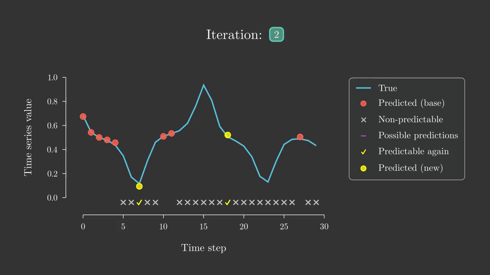

# Chaotic Time Series Forecasting
\



## Description

Masters thesis at HSE University


## Directory structure

```
├── code
│   ├── data
│   ├── energy
│   │   ├── 01_base
│   │   ├── 02_pointwise
│   │   │   ├── 01_daemon
│   │   │   ├── 02_train_classifiers
│   │   │   ├── 03_run_algorithms
│   │   │   └── 04_plot_results
│   │   └── 03_wishart_clustering
│   │       ├── 01_wishart_motifs
│   │       ├── 02_daemon
│   │       ├── 03_train_classifiers
│   │       ├── 04_run_algorithms
│   │       └── 05_plot_results
│   └── lorenz
│       ├── 01_base
│       ├── 02_pointwise
│       │   ├── 01_daemon
│       │   ├── 02_train_classifiers
│       │   ├── 03_run_algorithms
│       │   └── 04_plot_results
│       └── 03_wishart_clustering
│           ├── 01_wishart_motifs
│           ├── 02_daemon
│           ├── 03_train_classifiers
│           ├── 04_run_algorithms
│           └── 05_plot_results
└── utils
```
